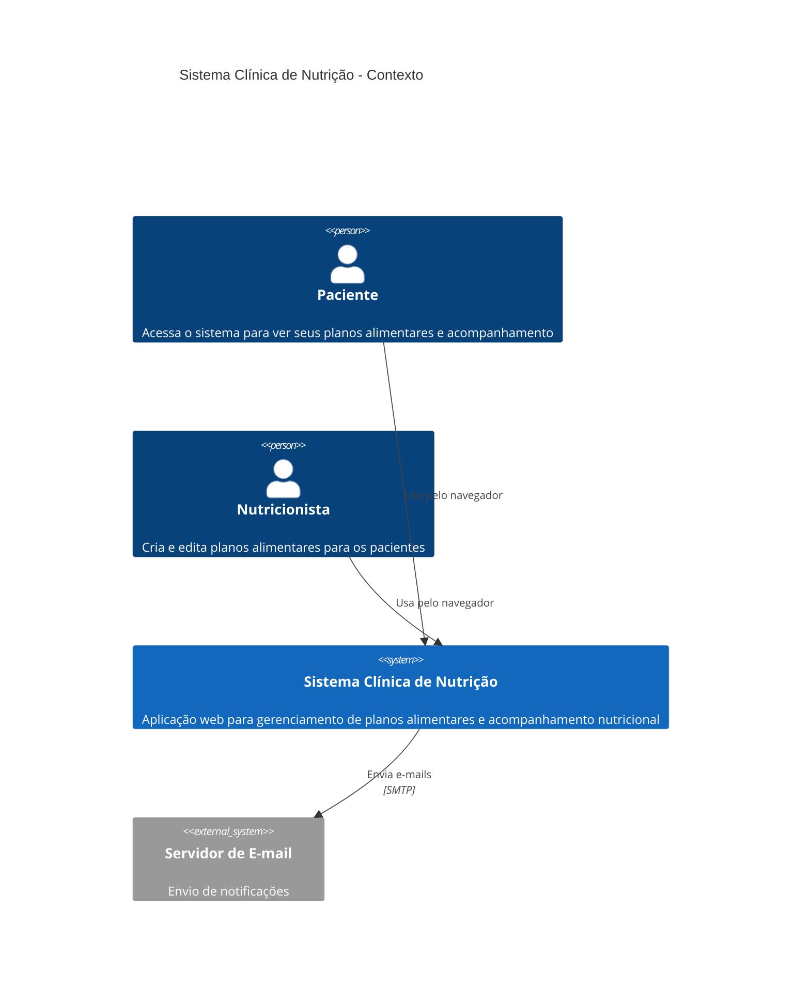
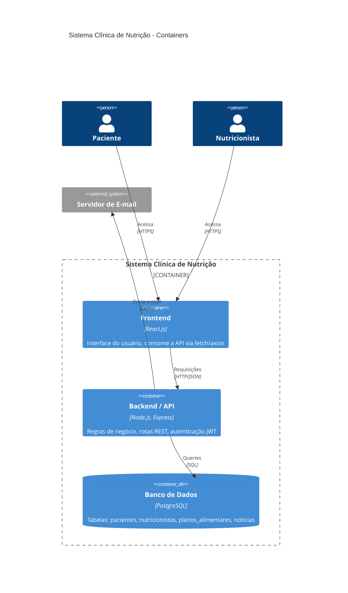

# Diagramas C4 – Sistema Clínica de Nutrição

## Nível 1 – Contexto

```mermaid
C4Context
    title Sistema Clínica de Nutrição - Contexto

    Person(paciente, "Paciente", "Acessa o sistema para ver seus planos alimentares e acompanhamento")
    Person(nutri, "Nutricionista", "Cria e edita planos alimentares para os pacientes")

    System(sys, "Sistema Clínica de Nutrição", "Aplicação web para gerenciamento de planos alimentares e acompanhamento nutricional")

    System_Ext(email, "Servidor de E-mail", "Envio de notificações")

    Rel(paciente, sys, "Usa pelo navegador")
    Rel(nutri, sys, "Usa pelo navegador")
    Rel(sys, email, "Envia e-mails", "SMTP")
```

## Nível 2 – Containers

```mermaid
C4Container
    title Sistema Clínica de Nutrição - Containers

    Person(paciente, "Paciente")
    Person(nutri, "Nutricionista")

    Container_Boundary(app, "Sistema Clínica de Nutrição") {
        Container(front, "Frontend", "React.js", "Interface do usuário, consome a API via fetch/axios")
        Container(api, "Backend / API", "Node.js, Express", "Regras de negócio, rotas REST, autenticação JWT")
        ContainerDb(db, "Banco de Dados", "PostgreSQL", "Tabelas: pacientes, nutricionistas, planos_alimentares, noticias")
    }

    System_Ext(email, "Servidor de E-mail")

    Rel(paciente, front, "Acessa", "HTTPS")
    Rel(nutri, front, "Acessa", "HTTPS")
    Rel(front, api, "Requisições", "HTTP/JSON")
    Rel(api, db, "Queries", "SQL")
    Rel(api, email, "Envia e-mail", "SMTP")
```
